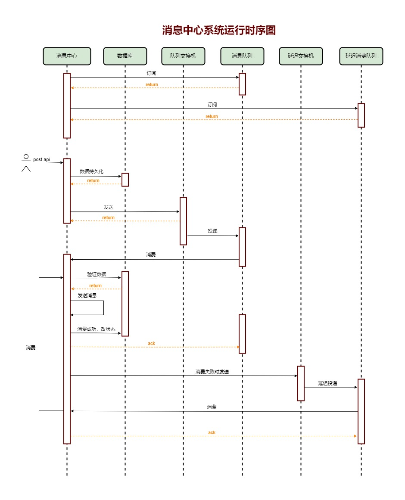

### 1、场景概述
消息中心适用于软件系统有发送消息的场景，其中消息渠道目前支持邮件、短息（发送逻辑待实现）、企业微信（发送逻辑待实现）
### 2、优势
- 系统解耦
- 消息时序性、可靠性
- 成熟的失败重试机制，经过千万级并发的互联网项目考验
### 3、技术框架
- .net 8
- mysql 9.0.1
- RabbitMQ 4.0.0
  - topic模式
  - 官方延迟消息插件
  rabbitmq_delayed_message_exchange
  - 可视化界面
  http://139.155.133.198:15672/ admin/admin123456
  - 安装教程
  https://note.youdao.com/s/Evg9AuTi
### 4、系统运行时序图

### 5、接口文档
- 第三方向消息中心发送消息
```
post http://127.0.0.1:9082/api/Message/SendMessage
[
  {
    "Title": "合同到期提醒标题",
    "Content": "合同到期提醒内容",
    "DynamicParameter":{
      "UserName": " Mr. John Doe",
      "ContractNo": "ht-001"
    },
    "LinkUrl": "www.baidu.com",
    "LinkText": "点击此处处理",
    "BusinessTypeKey": "ContractExpirationReminder",
    "BusinessTypeValue": "合同到期提醒",
    "Sendchannel": "1",
    "Sender": {
      "UserId": "1001",
      "UserName": "sch"
    },
    "Receiver": [
      {
        "ReceiverUserid": "2001",
        "ReceiverName": "shichaohu",
        "Email": "shichaohu@live.com",
        "CcEmail": "502242999@qq.com",
        "Phone": "13188888888",
        "EnterpriseWechat": "ty-xx001",
        "Dingtalk": "dd-xx002",
        "OtherReceiveChannel": ""
      }
    ]
  }
]

response:
{
	"code": 200,
	"message": "操作成功，消息已经写入发送队列！"
}

```

| 参数名称 | 类型 | 描述 |
| --- | --- | --- |
| Title | string | 消息标题，有模板时覆盖 |
| Content | string | 消息内容，有模板时覆盖 |
| DynamicParameter | json object | 动态参数，用于填充消息模板 |
| LinkUrl | string | 跳转连接，尚未使用 |
| LinkText | string | 跳转连接，尚未使用 |
| BusinessTypeKey | string | 业务类型key，用于标记消息模板 |
| BusinessTypeValue | string | 业务类型key，消息模板名称 |
| Sendchannel | int | 发送渠道，1=邮件，2=短息3=企业微信...  |
| Sender | json object | 发送者信息，冗余记录，无业务操作逻辑 |
| Receiver | json object array | 接收者，数组 |
| Receiver.ReceiverUserid | string | 接收者的id |
| Receiver.ReceiverName | string | 接收者的姓名 |
| Receiver.Email | string | 接收者的邮箱，多个英文逗号隔开 |
| Receiver.CcEmail | string | 抄送邮箱，多个英文逗号隔开 |
| Receiver.Phone | string | 接收者的手机 |
| Receiver.EnterpriseWechat | string | 接收者的企业微信 |
| Receiver.Dingtalk | string | 接收者的钉钉 |
| Receiver.OtherReceiveChannel | string | 其他渠道，尚未使用 |